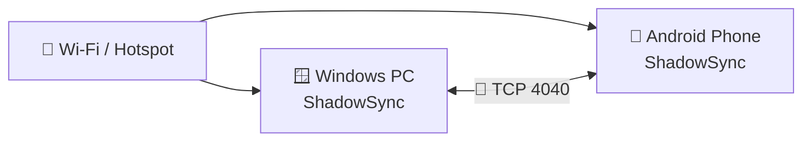
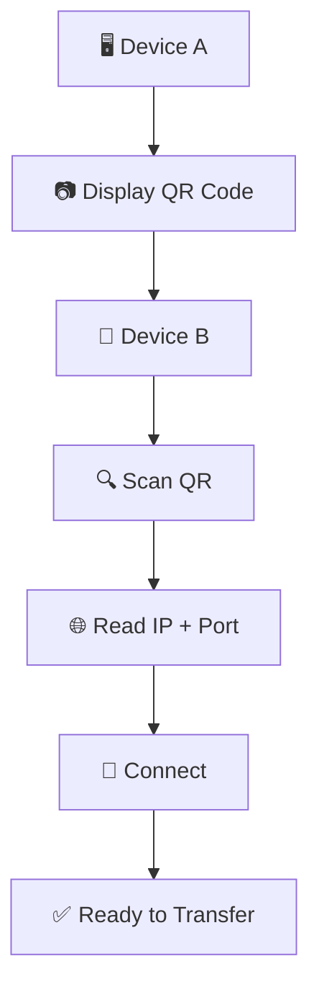
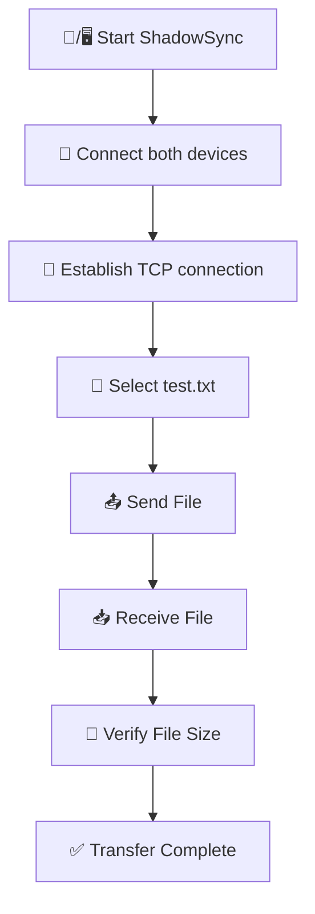

# 📦 ShadowSync Installation Guide

> **Install ShadowSync on Windows or Android — no development environment required.**

This guide explains how to install and run the pre-built ShadowSync releases included in the project.

You **do not need Flutter, Dart, Android Studio, or Visual Studio** to use the pre-built applications.

---

# 📁 Release Files

The project contains pre-built releases in the root directory:

```text
ShadowSync/
│
├── 📁 release/
│   │
│   ├── 📁 android_app/
│   │    │
│   │    └── 📱 app-release.apk
│   │
│   ├── 🪟 shadowsync2.0.exe
│   │
│   └── 📦 shadowsyncwindows.zip
│
└── 📄 README.md
```

Choose the installation method for your platform below.

---

# 🪟 Windows Installation

ShadowSync provides **two Windows versions**:

| Version             | Description                       | Installation |
| ------------------- | --------------------------------- | ------------ |
| 🛠️ **Setup**        | Standard Windows installation     | Required     |
| 📦 **Portable ZIP** | Run directly without installation | Not required |

---

## 🛠️ Option 1 — Windows Setup

The Windows setup package provides the normal installation experience.

### 📍 Step 1 — Open the release directory

From the project root, open:

```text
release/
```

Look for the Windows setup file.

For example:

```text
release/
└── shadowsync2.0.exe
```

> ℹ️ The exact filename may vary depending on the release version.

---

### ▶️ Step 2 — Run the installer

Double-click the Windows setup file.

```text
shadowsync2.0.exe
```

Windows may display a security confirmation depending on your system configuration.

If you trust the release source, continue with the installation.

---

### 📂 Step 3 — Choose the installation location

Follow the installer instructions.

The installer will place the required ShadowSync application files on your computer.

---

### 🚀 Step 4 — Launch ShadowSync

After installation, launch ShadowSync from:

- 🖥️ Desktop shortcut, if created
- 🪟 Windows Start Menu
- 📂 Installed application directory

---

# 📦 Option 2 — Portable Windows Version

If you don't want to install ShadowSync, use the **portable ZIP version**.

This version can be run directly from a folder.

### 📍 Step 1 — Open the release directory

```text
release/
```

Find the Windows portable ZIP file.

For example:

```text
release/
└── shadowsyncwindows.zip
```

---

### 📥 Step 2 — Extract the ZIP

Right-click the ZIP file and choose:

```text
Extract All...
```

Extract it to a location of your choice.

For example:

```text
C:\Apps\ShadowSync\
```

---

### ⚠️ Important: Keep the folder together

The portable ZIP contains the executable along with required:

- `.dll` files
- Runtime libraries
- Support libraries
- Other application dependencies

The structure may look similar to:

```text
shadowsyncwindows/
│
├── client.exe
├── *.dll
├── data/
├── flutter_windows.dll
└── other support files...
```

> ⚠️ **Do not move the `.exe` file away from the extracted folder.**

The executable may require the included DLLs and support files to run correctly.

---

### 🚀 Step 3 — Run ShadowSync

Open the extracted folder and double-click:

```text
shadowsync2.0.exe.exe
```

That's it.

No installation is required.

# 📱 Android Installation

ShadowSync also provides a pre-built Android APK.

The APK can be found inside:

```text
release/android_app/
```

For example:

```text
release/
└── android_app/
     └── app-release.apk
```

---

## 📍 Step 1 — Find the APK

From the project root, open:

```text
release/android_app
```

Locate:

```text
app-release.apk
```

---

## 📲 Step 2 — Transfer the APK to your Android device

You can copy the APK to your Android phone using:

- 🔌 USB cable
- 📡 Nearby Share
- ☁️ Cloud storage
- 💬 Messaging application
- 📁 Local network
- 💾 SD card
- Or download the repository in zip in your phone install the android app\
  then delete the repository

## 📥 Step 3 — Install the APK

Open the APK on your Android device.

Android may ask for permission to install applications from an unknown source.

If prompted, allow installation for the application/file manager you are using.

Then return to the APK and select:

```text
Install
```

Wait for the installation to complete.

---

## 🚀 Step 4 — Open ShadowSync

After installation, open ShadowSync from the Android application launcher.

---

# 🔐 Android Installation Permission

Depending on your Android version and device manufacturer, you may see a message such as:

> **For your security, your phone currently isn't allowed to install unknown apps from this source.**

If this happens:

1. Open the Android settings shown by the prompt.
2. Allow your browser/file manager to install unknown apps.
3. Return to the APK.
4. Start the installation again.

> ⚠️ Only enable this permission for APKs you trust.

You can disable the permission again after installation.

---

# 📡 Network Setup

Installing ShadowSync is only the first step.

For file transfers, the devices must also be able to communicate over the local network.

A typical setup is:



Both devices should normally be connected to the same local network.

---

# 🔌 Default TCP Port

ShadowSync uses:

```text
TCP 4040
```

Example peer address:

```text
192.168.1.25:4040
```

If you configure a different port, use that port when connecting the devices.

---

# 📷 Connecting with QR Code

ShadowSync can use a QR code to simplify peer connection.

The general process is:



Instead of manually typing:

```text
192.168.1.25:4040
```

the peer can scan the generated QR code.

---

# 🧪 Verify the Installation

After installing ShadowSync, verify that the application starts successfully.

## Windows

You should be able to launch:

```text
ShadowSync.exe
```

or open ShadowSync from the Windows Start Menu if you used the installer.

## Android

You should see ShadowSync in the Android application launcher.

---

# 📤 Test Your First Transfer

For your first test, use a small file.

For example:

```text
test.txt
```

### Recommended process



Once a small file works correctly, try larger files such as:

- 📷 Photos
- 🎥 Videos
- 📄 Documents
- 📦 ZIP archives
- 💾 Large datasets

---

# ⚠️ Windows Troubleshooting

## ❌ Application Does Not Start

If the portable version does not start:

### Check that all files were extracted

The executable should remain together with its support files:

```text
ShadowSync/
├── ShadowSync.exe
├── *.dll
├── data/
└── other dependencies
```

Do **not** copy only the `.exe` file.

### Try the installer version

If the portable version does not work correctly, try the Windows setup package from:

```text
release/
```

---

## ❌ Windows Firewall Blocks ShadowSync

Windows Firewall may ask whether ShadowSync should be allowed to communicate on the network.

For local-network file transfer, allow ShadowSync on the appropriate **Private network** when appropriate for your environment.

The application requires the TCP port:

```text
4040
```

to be reachable by the peer.

---

# ⚠️ Android Troubleshooting

## ❌ APK Will Not Install

Check:

- [ ] The APK downloaded/copied completely.
- [ ] The APK is compatible with your Android device.
- [ ] Android allows installation from the selected source.
- [ ] There is enough storage space.
- [ ] An incompatible older version is not causing an installation conflict.

---

## ❌ Android Cannot Connect to Windows

Check:

- [ ] Both devices are connected to the same Wi-Fi.
- [ ] Windows Firewall allows ShadowSync.
- [ ] TCP port `4040` is reachable.
- [ ] The correct Windows LAN IP is being used.
- [ ] VPN software is disabled or correctly configured.
- [ ] AP/client isolation is disabled.
- [ ] Windows and Android are not connected to isolated networks.

---

# 🚧 Wi-Fi Client Isolation

Some routers prevent devices connected to the same Wi-Fi network from communicating with each other.

This feature may be called:

```text
AP Isolation
```

or:

```text
Client Isolation
```

If enabled:

```text
📱 Android
    │
    X
    │
🖥️ Windows
```

ShadowSync may not be able to connect.

If you experience this problem, check the router's Wi-Fi settings.

---

# 📶 Using a Mobile Hotspot

ShadowSync may also work through a compatible mobile hotspot/local Wi-Fi configuration.

Example:

```text
        📱 Hotspot
           │
     ┌─────┴─────┐
     │           │
     ▼           ▼
 🖥️ Windows   📱 Android
```

Both devices need local network connectivity to each other.

> 💡 Internet access is not necessarily required for the file transfer itself. The important requirement is that the devices can reach each other over the local network.

---

# 🔐 Security Note

The current ShadowSync transfer protocol is intended primarily for **trusted local networks**.

The current architecture does not automatically provide end-to-end encryption.

Therefore:

> ⚠️ Avoid using ShadowSync on an untrusted network when transferring sensitive files unless appropriate security features have been added.

Future versions may introduce:

- 🔐 Encryption
- 👤 Peer authentication
- 🔑 Session keys
- 🛡️ TLS
- 🎟️ Pairing tokens

---

# 📁 Release Directory Reference

A typical project distribution may look like:

```text
ShadowSync/
│
├── 📁 release/
│   │
│   ├── 🪟 ShadowSync Setup
│   │
│   └── 📦 ShadowSync Windows Portable ZIP
│
├── 📁 android/
│   │
│   └── 📱 app-release.apk
│
├── 📁 client/
│   │
│   └── 🦋 Flutter source
│
├── 📄 README.md
└── 📄 INSTALLATION.md
```

---

# 🆚 Which Version Should I Use?

| Situation                        | Recommended Version |
| -------------------------------- | ------------------- |
| 🖥️ Normal Windows installation   | 🛠️ Windows Setup    |
| 💻 Don't want to install         | 📦 Portable ZIP     |
| 💾 Run from another folder/drive | 📦 Portable ZIP     |
| 🧪 Testing releases              | 📦 Portable ZIP     |
| 📱 Android phone                 | 📱 Release APK      |
| 👨‍💻 Developing ShadowSync         | 🦋 Flutter source   |

---

# ⚡ Quick Reference

### 🪟 Windows — Installer

```text
1. Open release/
2. Run Windows Setup
3. Follow installation wizard
4. Launch ShadowSync
```

### 🪟 Windows — Portable

```text
1. Open release/
2. Extract the ZIP
3. Keep all DLL/support files together
4. Run ShadowSync.exe
```

### 📱 Android

```text
1. Open android/
2. Copy app-release.apk to Android
3. Open the APK
4. Allow installation if prompted
5. Install ShadowSync
6. Open the application
```

### 📡 Connect

```text
1. Connect both devices to the same local network
2. Start ShadowSync
3. Use QR pairing or enter the peer IP
4. Connect
5. Select a file
6. Start transfer
```

---

# 🎉 You're Ready!

Once ShadowSync is installed on both devices:

```text
        📂 FILE
          │
          ▼
     📱/🖥️ SENDER
          │
          │ 🔌 TCP
          │
          ▼
    📡 LOCAL NETWORK
          │
          │
          ▼
     📱/🖥️ RECEIVER
          │
          ▼
        💾 FILE
```

> 🚀 **No cloud. No upload server. No unnecessary infrastructure.**
>
> **Just direct local file transfer with ShadowSync.**
