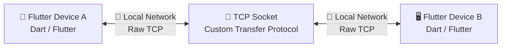
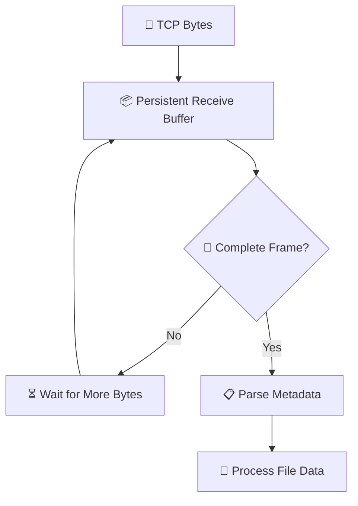
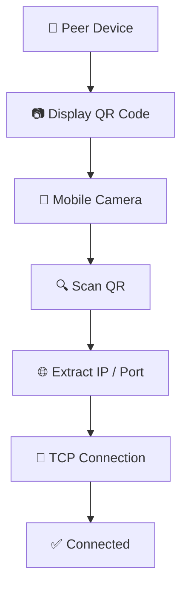
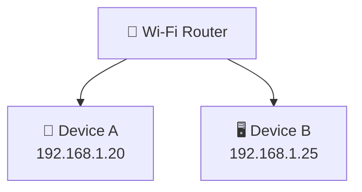
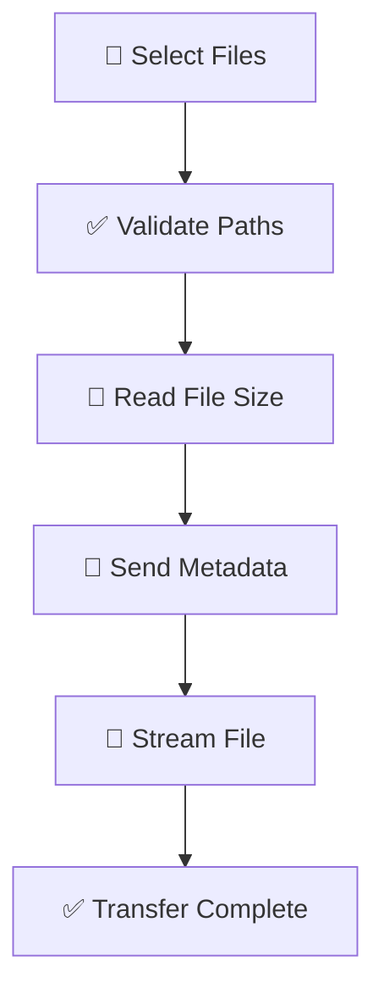
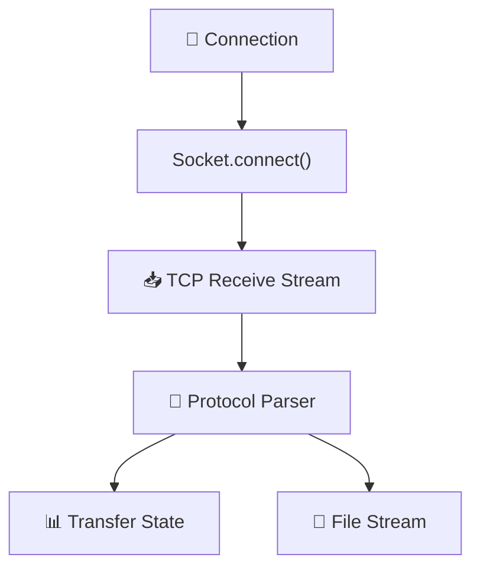
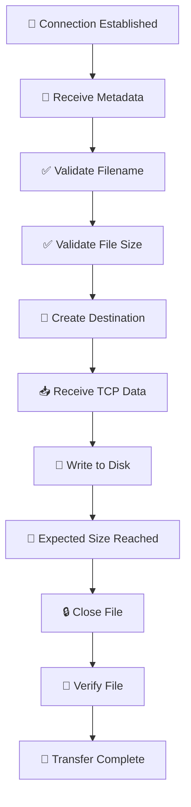
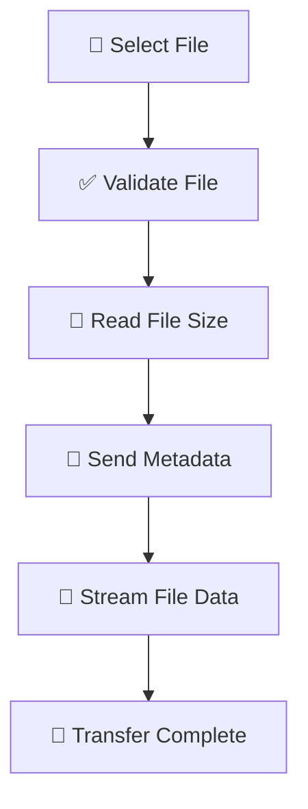
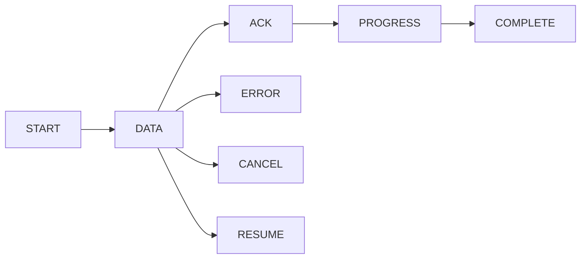
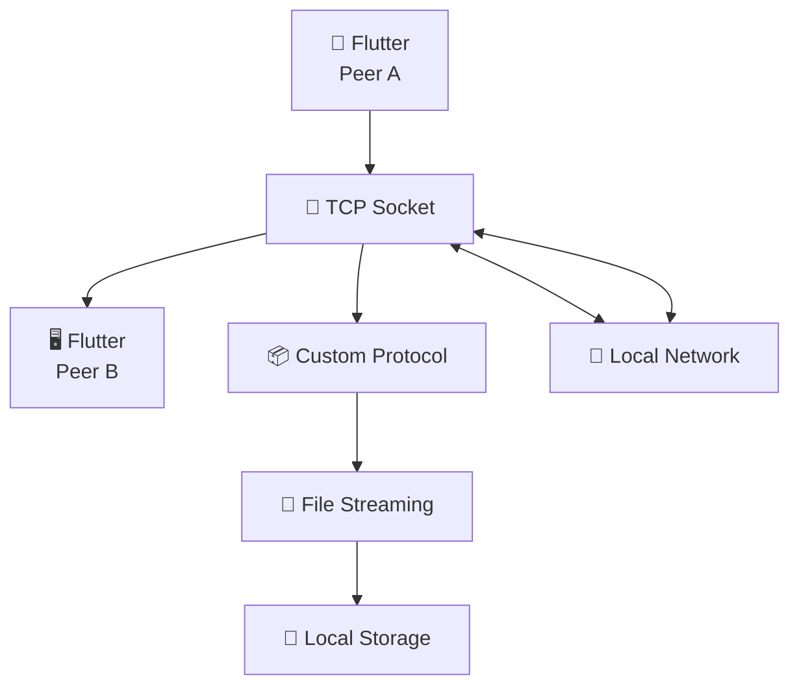

# ⚡ ShadowSync

> **Fast. Local. Direct. No Cloud.**

**ShadowSync** is a high-speed, peer-to-peer file-sharing application built entirely with **Flutter & Dart**.

It enables **Desktop ↔ Mobile** and **Mobile ↔ Mobile** file transfers directly over a local network without requiring:

- ☁️ Cloud storage
- 🌐 External file-hosting services
- 🖥️ Node.js/Express servers
- 🐘 PHP backends
- 🔄 HTTP upload/download infrastructure

Instead, ShadowSync uses **raw TCP sockets** and a lightweight custom transfer protocol to stream files directly between trusted devices.

> 🚀 **Goal:** Fast local file transfer with minimal overhead, reliable streaming, and zero cloud dependency.

---

## ✨ Features

| Feature                      | Description                                            |
| ---------------------------- | ------------------------------------------------------ |
| ⚡ **High-Speed Transfer**   | Direct device-to-device TCP streaming                  |
| 📱 **Mobile Support**        | Designed for Flutter mobile devices                    |
| 🖥️ **Desktop Support**       | Desktop ↔ mobile/local-device transfers                |
| 🔌 **Raw TCP**               | Persistent TCP socket communication                    |
| 📡 **Local Network**         | Works over Wi-Fi, hotspot, or compatible LAN           |
| 📦 **Large Files**           | Streams files without loading the entire file into RAM |
| 📁 **Multiple Files**        | Select and transfer multiple files sequentially        |
| 📷 **QR Pairing**            | Connect using a QR-encoded IP/port                     |
| 🛡️ **Filename Sanitization** | Prevents unsafe filesystem paths                       |
| 🔍 **Transfer Verification** | Validates received file size                           |
| 🗂️ **File Vault**            | Browse, open, delete, and manage received files        |
| ☁️ **No Cloud Required**     | Files remain between the connected peers               |

---

# 🚀 Quick Start

### 1️⃣ Clone the project

```bash
git clone <your-repository-url>
cd shadowsync/client
```

### 2️⃣ Install dependencies

```bash
flutter pub get
```

### 3️⃣ Check your Flutter environment

```bash
flutter doctor
```

### 4️⃣ Check available devices

```bash
flutter devices
```

### 5️⃣ Run ShadowSync

```bash
flutter run
```

### 6️⃣ Build Android

```bash
flutter build apk --release
```

Or build an Android App Bundle:

```bash
flutter build appbundle --release
```

---

# 🧭 Table of Contents

- [✨ Features](#-features)
- [🚀 Quick Start](#-quick-start)
- [🏗️ Architecture](#️-architecture)
- [🛠️ Technology Stack](#️-technology-stack)
- [📡 Custom Transfer Protocol](#-custom-transfer-protocol)
- [💻 Protocol Implementation](#-protocol-implementation)
- [📦 File Transfer Pipeline](#-file-transfer-pipeline)
- [🧠 TCP Byte Stream](#-tcp-byte-stream)
- [📋 File Metadata](#-file-metadata)
- [🔎 Transfer Verification](#-transfer-verification)
- [📁 File Storage](#-file-storage)
- [🛡️ Filename Safety](#️-filename-safety)
- [🔌 Connection](#-connection)
- [📷 QR Code Connection](#-qr-code-connection)
- [📶 Network Requirements](#-network-requirements)
- [🚧 AP Isolation](#-ap-isolation)
- [🔐 VPNs & Virtual Networks](#-vpns--virtual-networks)
- [🔥 Firewall](#-firewall)
- [📂 File Selection](#-file-selection)
- [📦 Multiple File Transfers](#-multiple-file-transfers)
- [🕘 Transfer History](#-transfer-history)
- [🗄️ Received File Vault](#️-received-file-vault)
- [⚡ Performance](#-performance)
- [🔒 Security](#-security)
- [🔏 Data Privacy](#-data-privacy)
- [🧯 Error Handling](#-error-handling)
- [📁 Project Structure](#-project-structure)
- [🔄 Transfer Lifecycle](#-transfer-lifecycle)
- [❓ Why TCP?](#-why-tcp)
- [🌐 Why Not HTTP?](#-why-not-http)
- [☁️ Why Not Cloud Storage?](#️-why-not-cloud-storage)
- [⚠️ Limitations](#️-limitations)
- [🧰 Troubleshooting](#️-troubleshooting)
- [👨‍💻 Development](#‍-development)
- [🔮 Future Improvements](#-future-protocol-improvements)
- [📜 License](#-license)
- [⚠️ Disclaimer](#️-disclaimer)
- [💭 Project Philosophy](#-project-philosophy)

---

# 🏗️ Architecture

ShadowSync is built around a simple peer-to-peer architecture.



### 🔥 Core idea

```text
Flutter
   ↓
Dart TCP Socket
   ↓
Custom Transfer Protocol
   ↓
Local Network
   ↓
Dart TCP Socket
   ↓
Flutter
```

There is **no required cloud relay** in the core transfer path.

---

# 🛠️ Technology Stack

## 🦋 Flutter

Flutter handles:

- 🎨 Cross-platform UI
- 📱 Application lifecycle
- 📂 File selection
- 💾 Storage integration
- 📷 QR scanning
- 🧩 Platform integration

## 🎯 Dart

Dart handles:

- 🔌 TCP networking
- 📡 Socket communication
- 📂 File streaming
- 🔤 Protocol encoding/decoding
- 🧾 JSON serialization
- 📊 Transfer state
- 💾 Filesystem operations
- 🔄 Connection handling

## 🔌 TCP Sockets

ShadowSync uses Dart's `Socket` API.

A connection is established using:

```dart
Socket.connect(host, port)
```

Once connected, the socket remains open while transfers are performed.

TCP provides:

- ✅ Reliable delivery
- ✅ Ordered byte-stream delivery
- ✅ Retransmission
- ✅ Flow control
- ✅ Connection state

---

# 📡 Custom Transfer Protocol

ShadowSync uses a lightweight application-level protocol on top of TCP.

The current metadata header is:

```text
P2P_META:<filename>|<size>||
```

Example:

```text
P2P_META:video.mp4|104857600||
```

The structure is:

```text
P2P_META:
    │
    ├── Filename
    │
    ├── |
    │
    ├── File Size
    │
    └── ||
         ↓
      Binary Data
```

### 📋 Protocol fields

| Field      | Encoding   | Purpose                            |
| ---------- | ---------- | ---------------------------------- |
| `P2P_META` | UTF-8 text | Identifies metadata                |
| `filename` | UTF-8 text | File name                          |
| `\|`       | UTF-8 text | Field separator                    |
| `size`     | UTF-8 text | File size in bytes                 |
| `\|\|`     | UTF-8 text | Marks the beginning of binary data |
| File data  | Binary     | Actual file contents               |

> ⚠️ **Important:** The metadata header and binary file data are transported through the same TCP byte stream.

---

# 💻 Protocol Implementation

## 📤 Sender

The sender first writes the metadata header:

```dart
_sessionSocket!.write(
  "P2P_META:$filename|$filesize||",
);

await _sessionSocket!.flush();
```

The file is then streamed:

```dart
final Stream<List<int>> systemPipe = uploadFile.openRead();

int uploadedBytesCount = 0;

await for (final List<int> piece in systemPipe) {
  _sessionSocket!.add(piece);

  uploadedBytesCount += piece.length;

  setState(() {
    _streamProgress =
        filesize > 0
            ? (uploadedBytesCount / filesize).clamp(0.0, 1.0)
            : 0.0;
  });
}

await _sessionSocket!.flush();
```

### 📤 Sender pipeline


---

# 📥 Receiver

The receiver maintains a buffer until the metadata delimiter `||` is found.

```dart
if (!fileHeaderParsed) {
  packetBuffer.addAll(segment);

  final String initialStr =
      utf8.decode(packetBuffer, allowMalformed: true);

  if (initialStr.contains("||")) {
    final blocks = initialStr.split("||");

    final dataFields =
        blocks[0]
            .replaceAll("P2P_META:", "")
            .split('|');

    incomingFilename = dataFields[0];
    incomingFileSize = int.parse(dataFields[1]);

    final int headerLength =
        utf8.encode("${blocks[0]}||").length;

    final List<int> dataRemainder =
        packetBuffer.sublist(headerLength);

    final File targetLocalFile =
        File("$_cachedStorageDirectoryPath/$incomingFilename");

    downloadSink = targetLocalFile.openWrite();

    fileHeaderParsed = true;
    packetBuffer.clear();
  }
}
```

### 📥 Receiver pipeline


---

# 📦 File Transfer Pipeline

ShadowSync does **not** load an entire file into memory.

Instead, files are streamed in chunks.


This means a **5 GB file does not need 5 GB of RAM**.

Only a portion of the file is processed at a time.

---

# 🧠 TCP Byte Stream

> ⚠️ **Critical networking concept**

TCP does **not** preserve application-level message boundaries.

If the sender writes:

```text
MESSAGE A
MESSAGE B
MESSAGE C
```

the receiver might receive:

```text
MESSAGE A + MESSAGE B
```

or:

```text
MESSAGE A
MESSAGE B + MESSAGE C
```

or:

```text
PART OF MESSAGE A
```

followed later by:

```text
REST OF MESSAGE A
```

Therefore, this assumption is incorrect:

```dart
socket.listen((data) {
  // data == one complete message
});
```

Instead, ShadowSync maintains a persistent receive buffer.



This is one of the most important considerations in the networking layer.

---

# 📋 File Metadata

The metadata format is:

```text
P2P_META:<filename>|<size>||
```

Example:

```text
P2P_META:video.mp4|104857600||
```

Which represents:

| Property          | Value             |     |     |
| ----------------- | ----------------- | --- | --- |
| 📄 Filename       | `video.mp4`       |     |     |
| 📏 Size           | `104857600 bytes` |     |     |
| 🔚 Data delimiter | `                 |     | `   |

The receiver parses the metadata before consuming the corresponding binary file data.

---

# 🔎 Transfer Verification

After receiving a file, ShadowSync verifies the resulting file size.

Example:

```text
Expected:
104857600 bytes

Received:
104857600 bytes
```

The basic validation is:

```text
received bytes == expected bytes
```

If the values do not match:

```text
❌ Transfer Failed
      ↓
🗑️ Incomplete File Removed
```

This prevents incomplete files from being incorrectly reported as successfully transferred.

---

# 📁 File Storage

Received files are stored inside the application's ShadowSync storage directory.

Conceptually:

```text
Download/
└── ShadowSync/
    ├── 📷 photo.jpg
    ├── 🎥 video.mp4
    ├── 📄 document.pdf
    └── 📦 archive.zip
```

On Android, the application attempts to use the device's Download storage when available.

---

# 🛡️ Filename Safety

Incoming filenames are sanitized before being written to disk.

Unsafe characters include:

```text
\
/
:
*
?
"
<
>
|
```

Control characters are also removed or replaced.

This helps prevent an incoming filename from constructing an unsafe filesystem path.

### ♻️ Duplicate filenames

If a file already exists:

```text
photo.jpg
photo (1).jpg
photo (2).jpg
photo (3).jpg
```

ShadowSync handles duplicate names automatically.

---

# 🔌 Connection

Peers can connect using a local IP address.

Example:

```text
192.168.1.25
```

A custom port can also be supplied:

```text
192.168.1.25:4040
```

### Default port

```text
TCP 4040
```

---

# 📷 QR Code Connection

ShadowSync supports QR-based connection setup.

Instead of manually typing an IP address, a peer can scan a QR code containing the endpoint.



Example QR payload:

```text
192.168.1.25:4040
```

This reduces manual IP-address entry and makes local pairing easier.

---

# 📶 Network Requirements

Both devices should normally be connected to the same local network.



Both devices must be able to reach:

```text
TCP 4040
```

### 💡 Hotspot

ShadowSync can also work through a compatible mobile hotspot/local Wi-Fi setup:

```text
📱 Hotspot
   │
   ├── Device A
   │
   └── Device B
```

---

# 🚧 AP Isolation

Some Wi-Fi routers enable:

```text
AP Isolation
```

or:

```text
Client Isolation
```

When enabled, wireless clients may be prevented from communicating directly with each other.

### ❌ Symptom

Both devices appear connected to the same Wi-Fi, but:

```text
Device A ──X── Device B
```

### ✅ Solution

Check the router's wireless settings and disable client/AP isolation if local peer-to-peer communication is required.

---

# 🔐 VPNs & Virtual Networks

VPN software and virtual network adapters can affect local routing.

Potential sources include:

- 🔐 VPN clients
- 🖥️ Virtual machines
- 📦 Container networking
- 🧪 Development network interfaces
- 🔌 Virtual network adapters

The displayed IP address may not always be the address reachable by the peer.

For normal operation, use an IP address reachable from the other device.

---

# 🔥 Firewall

The operating-system firewall may block incoming TCP connections.

ShadowSync requires the configured TCP port to be reachable.

### Default

```text
TCP 4040
```

If devices are on the same network but cannot connect:

1. Check the firewall.
2. Allow ShadowSync through the firewall.
3. Allow TCP port `4040`.
4. Ensure the network is classified as a trusted/private network where appropriate.

---

# 📂 File Selection

ShadowSync supports selecting multiple files.

The general workflow is:



---

# 📦 Multiple File Transfers

Multiple files can be selected and transferred sequentially.

Example:

```text
📷 photo.jpg
🎥 video.mp4
📄 document.pdf
📦 archive.zip
```

Each file has its own:

- Metadata
- File size
- Progress
- Transfer state
- Completion status

---

# 🕘 Transfer History

ShadowSync maintains transfer records containing information such as:

| Information   | Example            |
| ------------- | ------------------ |
| 📄 Filename   | `video.mp4`        |
| 📏 File size  | `100 MB`           |
| 📦 File type  | `video/mp4`        |
| ↔️ Direction  | Send / Receive     |
| 🕐 Timestamp  | Transfer time      |
| 🌐 Peer       | `192.168.1.25`     |
| 📁 Local path | Storage location   |
| 📊 Bytes      | Transferred amount |
| ✅ Status     | Completed          |
| ❌ Error      | Error information  |

---

# 🗄️ Received File Vault

Received files are displayed in the application's file vault.

Users can:

- 👀 View files
- 📂 Open files
- 🗑️ Delete files
- 🔄 Refresh the list
- 📏 View file sizes

Files remain stored locally rather than being uploaded to an external service.

---

# ⚡ Performance Design

ShadowSync is designed around **streaming rather than whole-file buffering**.

### ❌ Avoid

```text
Entire File
     ↓
   RAM
     ↓
   TCP
```

### ✅ ShadowSync

```text
Disk
 ↓
Stream
 ↓
TCP
 ↓
Network
 ↓
TCP
 ↓
File Sink
 ↓
Disk
```

This significantly reduces memory requirements for large transfers.

---

# 📈 Performance Considerations

Actual transfer speed depends on the entire network and storage pipeline.

Important factors include:

- 📶 Wi-Fi generation
- 🔌 Ethernet speed
- 📡 Signal quality
- 📡 Router performance
- 📱 Device hardware
- 💾 Storage read speed
- 💾 Storage write speed
- 🌐 TCP congestion control
- 📻 Network interference
- ⚙️ Operating-system activity

> 💡 **The slowest significant component of the pipeline can become the bottleneck.**

A high-end Wi-Fi connection does not guarantee the same disk-to-disk transfer speed if the receiving device has slow storage.

---

# 🔒 Security

> ⚠️ **Important:** ShadowSync is primarily designed for trusted local-network transfers.

The current raw TCP architecture should **not automatically be considered equivalent to an encrypted internet file-transfer protocol**.

For trusted local environments, the architecture provides direct peer-to-peer communication.

Future security enhancements may include:

- 🔐 Peer authentication
- 🔑 Session keys
- 🛡️ TLS
- 🔒 Application-level encryption
- 🎟️ Transfer authorization
- #️⃣ File integrity hashes
- 🤝 Pairing tokens

---

# 🔏 Data Privacy

ShadowSync does not require cloud storage for its core transfer operation.

The basic data path is:

```text
📱 Sender
   │
   │ Local TCP
   ▼
🖥️ Receiver
```

There is no required third-party cloud service relaying the file.

> 🔒 **Your files are transferred directly between the connected peers.**

---

# 🧯 Error Handling

ShadowSync handles several failure conditions:

- ❌ Invalid connection address
- ⏱️ Connection timeout
- 🔌 Connection loss
- 🧾 Invalid metadata
- 📄 Invalid filename
- 📏 Invalid file size
- 📦 Incomplete transfer
- 💾 Storage failure
- 🔌 Socket errors
- 📂 Missing source files

When a transfer cannot be verified, the incomplete file can be removed instead of being reported as successfully transferred.

---

# 📁 Project Structure

A typical project structure is:

```text
shadowsync/
└── client/
    ├── android/
    ├── ios/
    ├── lib/
    │   ├── main.dart
    │   ├── ...
    │   └── utils/
    │       └── transfer_record.dart
    │
    ├── assets/
    │   └── ...
    │
    ├── test/
    │   └── ...
    │
    ├── pubspec.yaml
    ├── analysis_options.yaml
    └── README.md
```

The exact structure may evolve as the project develops.

---

# 🧩 Core Networking Components

The networking layer is responsible for:



The Flutter UI should not be responsible for implementing the underlying network protocol.

For larger versions of ShadowSync, the networking and transfer engine should remain separated from Flutter widgets.

---

# 🔄 Transfer Lifecycle

## 📥 Receive



## 📤 Send



---

# ❓ Why TCP?

TCP was selected because ShadowSync requires reliable, ordered delivery of file data.

TCP provides:

| Capability         | TCP |
| ------------------ | --- |
| Reliable delivery  | ✅  |
| Ordered delivery   | ✅  |
| Retransmission     | ✅  |
| Flow control       | ✅  |
| Connection state   | ✅  |
| Congestion control | ✅  |

Therefore, ShadowSync does not need to implement raw packet retransmission.

The ShadowSync protocol instead handles **application-level transfer state**.

---

# 🌐 Why Not HTTP?

ShadowSync is intended for direct local file transfer rather than traditional web communication.

Raw TCP allows ShadowSync to maintain a persistent connection and implement its own lightweight transfer protocol.

The architecture therefore avoids introducing an unnecessary HTTP server/request-response layer for the core transfer path.

> 💡 This does **not** mean TCP is universally faster than HTTP. The goal is to give ShadowSync direct control over its application-level transfer protocol.

---

# ☁️ Why Not Cloud Storage?

A traditional cloud transfer may look like:


ShadowSync instead uses:


For devices on the same local network, this avoids unnecessary internet upload/download paths.

---

# ⚠️ Limitations

ShadowSync is primarily designed for local-network transfers.

Current limitations may include:

- 📡 Both peers need network reachability.
- 🔌 TCP port access must be available.
- 🚧 Wi-Fi client isolation can prevent connections.
- 🔥 Firewall rules can block connections.
- 🔐 VPNs can interfere with routing.
- 📶 Transfer speed depends on network quality.
- 💾 Storage performance can become a bottleneck.
- 🔒 The current protocol should be treated as a trusted-network protocol unless encryption/authentication is added.
- 🔄 A disconnected TCP session can interrupt an active transfer unless application-level resume is implemented.

---

# 🧰 Troubleshooting

## ❌ Cannot Connect

Check the following:

- [ ] Both devices are connected to the same network.
- [ ] The IP address is correct.
- [ ] The TCP port is correct.
- [ ] The firewall allows the connection.
- [ ] AP/client isolation is disabled.
- [ ] VPN software is not interfering.
- [ ] Wi-Fi remains connected even if the network has no internet.
- [ ] Connect to Wi-Fi **before opening ShadowSync**.
- [ ] Only one instance of the application is running where required.

### Default port

```text
4040
```

---

## 📷 QR Code Does Not Connect

Verify that the QR code contains a reachable peer endpoint.

Example:

```text
192.168.1.25:4040
```

The scanning device must be able to reach that address.

### ⚠️ Avoid localhost

If the QR code contains:

```text
127.0.0.1:4040
```

or:

```text
localhost:4040
```

the address refers to the **local device itself**, not the remote peer.

Use the peer's actual LAN IP address instead.

If the application cannot determine the correct IP:

1. Connect the device to Wi-Fi.
2. Confirm the device has a LAN IP.
3. Open ShadowSync after connecting.
4. Check the generated QR code again.

### 🔄 Manual connection

If QR scanning does not work, manually enter the peer IP address:

```text
192.168.1.25:4040
```

---

## ⏸️ Transfer Stops

Check:

- [ ] Wi-Fi signal strength
- [ ] Device storage availability
- [ ] Firewall behavior
- [ ] Network stability
- [ ] Whether the peer disconnected
- [ ] Whether the receiving device has enough free storage
- [ ] VPN/virtual-network configuration

---

## 📦 File Appears Incomplete

ShadowSync compares:

```text
received bytes
       vs
expected bytes
```

A successful transfer requires:

```text
received bytes == expected bytes
```

If they differ:

```text
❌ Transfer Failed
🗑️ Incomplete file removed
```

---

# 👨‍💻 Development

## 🔍 Static Analysis

```bash
flutter analyze
```

## 🧪 Tests

```bash
flutter test
```

## 🧹 Format Dart Source

```bash
dart format .
```

## ▶️ Run Application

```bash
flutter run
```

---

# 🔁 Recommended Development Workflow

After modifying networking or protocol code:

```bash
flutter analyze
flutter test
dart format .
flutter run
```

Network changes should be tested with:

- [ ] Small files
- [ ] Large files
- [ ] Multiple files
- [ ] Empty files
- [ ] Files with unusual names
- [ ] Duplicate filenames
- [ ] Connection interruption
- [ ] Device disconnection
- [ ] Slow networks
- [ ] High-speed networks

---

# 🧪 Recommended Test Matrix

| Test                    | Expected Result                                      |
| ----------------------- | ---------------------------------------------------- |
| 📄 Small file           | Successful transfer                                  |
| 🎥 Large video          | Streaming without excessive RAM usage                |
| 📦 Multiple files       | Sequential transfers                                 |
| 📛 Duplicate filename   | Safe renamed file                                    |
| 📝 Unicode filename     | Sanitized/handled safely                             |
| 🔌 Disconnect sender    | Transfer failure detected                            |
| 🔌 Disconnect receiver  | Transfer failure detected                            |
| 📶 Weak Wi-Fi           | Transfer remains TCP-reliable if connection survives |
| 💾 Insufficient storage | Transfer fails safely                                |
| 🔥 Firewall blocked     | Connection fails gracefully                          |
| 🚧 AP isolation         | Connection failure is identifiable                   |
| 🔐 VPN enabled          | Routing remains correct or failure is diagnosable    |

---

# 🔮 Future Protocol Improvements

The protocol architecture leaves room for more advanced transfer capabilities.

A future protocol could introduce:



Potential improvements include:

- #️⃣ SHA-256 file verification
- 🧩 Chunk-level integrity verification
- 🔄 Resumable transfers
- ❌ Transfer cancellation
- ⏸️ Transfer pause/resume
- 🤝 Peer capability negotiation
- 📦 Concurrent transfer queues
- 🚦 Bandwidth management
- 🔐 Encryption
- 👤 Peer authentication
- 🔎 Automatic peer discovery
- 🆔 Transfer IDs
- 📊 More detailed transfer acknowledgements

---

# 📜 License

ShadowSync is distributed under a **custom non-commercial license**.

## ✅ Permitted Use

The software may be:

- Used privately
- Used for educational purposes
- Used for testing
- Used for personal projects
- Compiled and executed
- Distributed without commercial profit

## 🚫 Commercial Restrictions

The software may not be:

- Sold
- Leased
- Commercially licensed
- Monetized
- Repackaged for paid distribution
- Used as a commercial service
- Used to create a commercial derivative product

No individual, organization, or entity is authorized to commercially exploit the software without explicit permission from the copyright holder.

> ⚠️ **Note:** The actual legal terms of a custom license should be provided in a dedicated `LICENSE` file.

---

# ⚠️ Disclaimer

ShadowSync is provided on an **"AS IS"** basis.

No warranty is provided regarding:

- Network availability
- Transfer speed
- Device compatibility
- Storage behavior
- Operating-system behavior
- Filesystem behavior
- Hardware failures
- Network interruptions
- Data loss
- Application crashes
- Incomplete transfers

Users are responsible for maintaining appropriate backups of important data.

> 💡 ShadowSync should **not** be considered a replacement for a dedicated backup system.

---

# 💭 Project Philosophy

ShadowSync follows a simple principle:

```text
        ☁️ NO CLOUD
            +
      🖥️ NO SERVER
            +
      🌐 NO HTTP LAYER
            +
       🔌 RAW TCP
            +
       📦 CUSTOM PROTOCOL
            +
       💾 LOCAL STORAGE
            =
      ⚡ SHADOWSYNC
```

Or simply:

> **Flutter + Dart + TCP + Custom Protocol + Local Storage**

The goal is to provide a direct, fast, transparent, and controllable file-transfer pipeline between trusted devices on a local network.

---

# 🧾 Summary

**ShadowSync** is a Flutter/Dart peer-to-peer file-transfer application using raw TCP sockets and a custom application-level transfer protocol.



### 🎯 Core Stack

```text
🦋 Flutter
   +
🎯 Dart
   +
🔌 TCP
   +
📦 Custom Transfer Protocol
   +
📂 File Streaming
   +
💾 Local Storage
```

> 🚀 **ShadowSync — Fast local file transfer without the cloud.**

---

## ⭐ Support the Project

If ShadowSync is useful to you:

- ⭐ Star the repository
- 🐛 Report bugs
- 💡 Suggest improvements
- 🔧 Submit pull requests
- 📢 Share the project

**Made with ❤️ By Roshan & Zaid using Flutter & Dart.**
